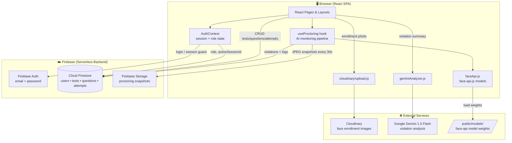
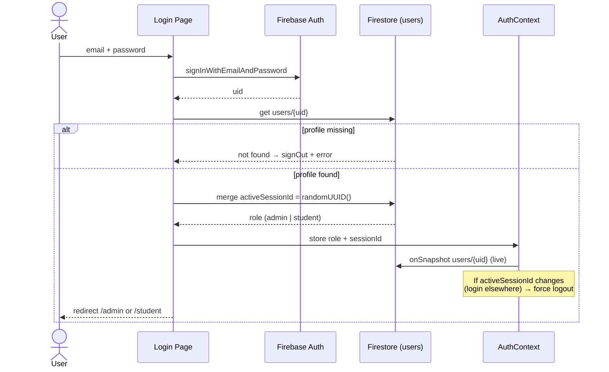
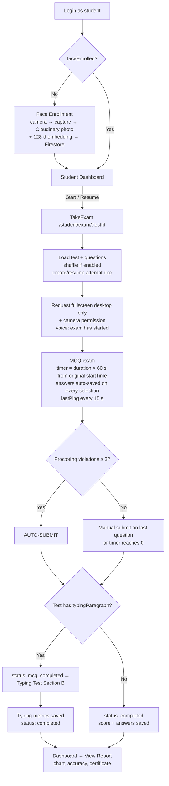
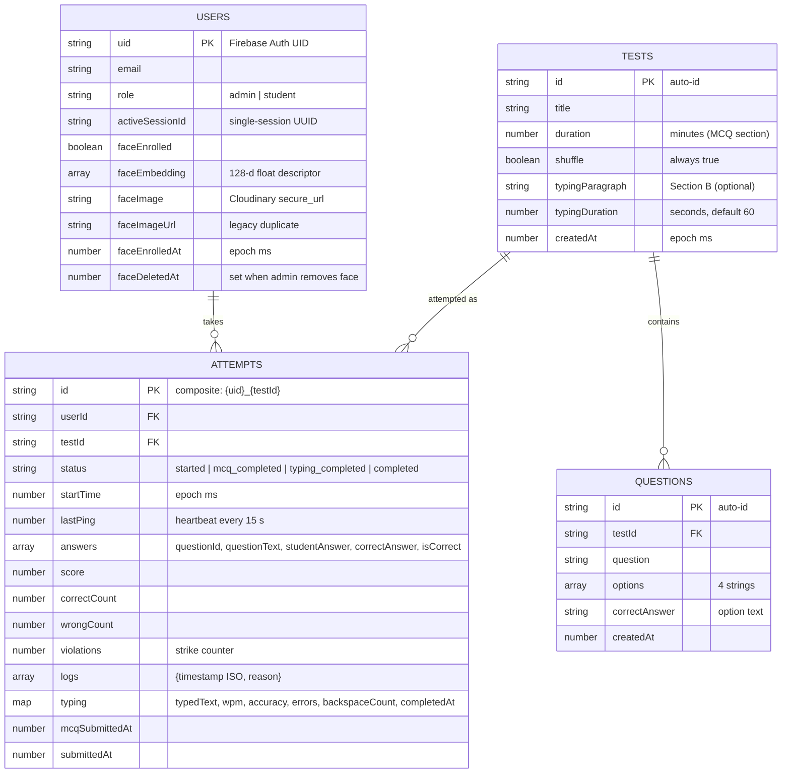

# 🛡️ ExamGuard (testgaurd)

**AI-Powered Proctored Exam Platform** — built with React + Vite + Firebase + face-api.js + Google Gemini

ExamGuard is a browser-based secure examination system. Admins create MCQ + typing tests, students take them under live AI proctoring (face verification, multi-face detection, tab-switch monitoring), and admins monitor everything in real time with AI-generated violation analysis.

---

## 📑 Table of Contents

1. [Tech Stack](#-tech-stack)
2. [High-Level Architecture](#-high-level-architecture)
3. [Folder-by-Folder Analysis](#-folder-by-folder-analysis)
4. [Application Workflows](#-application-workflows)
5. [AI Proctoring Engine — Deep Dive](#-ai-proctoring-engine--deep-dive)
6. [Database Design (Firestore)](#-database-design-firestore)
7. [External Services & API Work](#-external-services--api-work)
8. [Routing Map](#-routing-map)
9. [PWA Support](#-pwa-support)
10. [Setup & Installation](#-setup--installation)
11. [Environment Variables](#-environment-variables)
12. [Deployment](#-deployment)
13. [Known Limitations & Security Notes](#-known-limitations--security-notes)

---

## 🧰 Tech Stack

| Layer | Technology | Purpose |
|---|---|---|
| Frontend | React 18 + Vite 5 | SPA, fast dev/build |
| Routing | react-router-dom v6 | Role-based nested routes |
| Styling | Tailwind CSS 3 | Utility-first UI |
| Animations | framer-motion | Page/element transitions |
| Icons | lucide-react | Icon set |
| Auth | Firebase Authentication | Email/password login |
| Database | Cloud Firestore | Tests, questions, attempts, users (with offline persistent cache) |
| File Storage | Firebase Storage | Proctoring snapshots (`snapshots/{testId}/{userId}/…`) |
| Image CDN | Cloudinary (unsigned upload) | Face-enrollment photos |
| Face AI | @vladmandic/face-api (face-api.js) | Face detection, landmarks, 128-d embeddings |
| LLM AI | @google/generative-ai (Gemini 1.5 Flash) | Violation-log analysis → cheating probability |
| Charts | Chart.js + react-chartjs-2 | Result bar chart in report modal |
| PDF | jsPDF | Certificate generation |
| PWA | vite-plugin-pwa (Workbox) | Installable app, offline caching |

**No custom backend server exists** — this is a fully serverless/client-side architecture. All "API work" happens directly from the browser against Firebase, Cloudinary, and Gemini SDK/REST endpoints.

---

## 🏗 High-Level Architecture



### Architecture Principles

- **Contract = Firestore document shapes.** There is no REST API of its own; components read/write Firestore documents directly.
- **All AI runs client-side except Gemini.** Face detection/recognition executes in the browser via WASM/WebGL (face-api.js); only the violation-summary text analysis calls out to Gemini.
- **Single-session enforcement.** Every login writes a fresh `activeSessionId` (UUID) to `users/{uid}`; `AuthContext` live-listens to that doc and force-logs-out any stale session (prevents account sharing during exams).
- **Attempt document as single source of truth.** One document per student per test (`attempts/{uid}_{testId}`) accumulates answers, violations, logs, ping, score, and typing results — enabling resume-after-crash and live monitoring from the same record.

---

## 📂 Folder-by-Folder Analysis

```
testgaurd/
├── public/models/            ← ACTIVE face-api model weights (served at /models/)
├── src/                      ← All application source code
│   ├── components/ui/        ← Reusable UI (report modal, PWA prompts, demo sign-in)
│   ├── contexts/             ← AuthContext (global auth/role/session state)
│   ├── hooks/                ← useProctoring (AI monitoring engine)
│   ├── layouts/              ← AdminLayout, StudentLayout (shells + guards)
│   ├── lib/                  ← utils.js (cn() class-name merger)
│   ├── pages/                ← Route-level screens (admin / auth / student)
│   ├── routes/               ← AppRoutes + ProtectedRoute (role guards)
│   └── services/             ← Firebase, face-api, Gemini, Cloudinary clients
├── tiny_face_detector/       ← Model source folders (copied → public/models/)
├── face_landmark_68/         ←         "
├── face_recognition/         ←         "
├── face_expression/          ← Extra models (NOT used at runtime)
├── mtcnn/, ssd_mobilenetv1/, tiny_yolov2*/, uncompressed/, face_landmark_68_tiny/
│                             ← Additional face-api weights, unused by the app
├── dev-dist/                 ← Generated PWA service-worker output (dev)
├── setup-models.js           ← Prebuild script: copies model files → public/models/
├── fix-models.js             ← One-time repair script: MOVES all model files → public/models/
├── vite.config.js            ← Vite + React + PWA (Workbox) configuration
├── tailwind.config.js        ← Tailwind content paths (default theme)
├── postcss.config.js         ← Tailwind + autoprefixer
├── vercel.json               ← SPA rewrite (all routes → index.html)
├── .env / .env.example       ← Firebase env vars (see Environment Variables)
└── index.html                ← SPA entry, mounts /src/main.jsx
```

### `src/services/` — the "API layer"

| File | Responsibility |
|---|---|
| `firebase/config.js` | Initializes Firebase App, Auth, Firestore (with **persistent local cache** + single-tab manager), and Storage. Reads 6 `VITE_FIREBASE_*` env vars (falls back to `"dummy"`). |
| `firebase/auth.js` | `loginUser(email, pass)` → signs in, loads `users/{uid}`, rejects if the profile doc is missing, generates a session UUID, merges `activeSessionId`, returns `{ role, sessionId }`. `logoutUser(uid)` → clears `activeSessionId`, signs out. `getUserRole(uid)`. |
| `firebase/db.js` | Re-exports the Firestore instance for page-level queries. |
| `ai/faceApi.js` | Loads 3 models (`tinyFaceDetector`, `faceLandmark68Net`, `faceRecognitionNet`) from `${BASE_URL}/models` with HEAD-check verification and load caching. Exposes `loadModels()`, `getFaceEmbedding(video)` (single-face 128-d descriptor), `detectFaces(video)` (all faces), `compareEmbeddings(a, b)` (Euclidean distance). Detector: `inputSize 224`, `scoreThreshold 0.3`. |
| `ai/geminiAnalyzer.js` | `generateViolationSummary(violations)` → prompts **Gemini 1.5 Flash** as an "AI Proctoring Analyst"; returns `Cheating Probability: X%` + one-line summary. Uses `VITE_GEMINI_API_KEY`; gracefully degrades when key/violations are absent. |
| `cloudinary/upload.js` | `uploadToCloudinary(base64, publicId)` → unsigned POST to `api.cloudinary.com/v1_1/daopxrrp0/image/upload` with preset `examguard_faces`; returns `{ secure_url, public_id }`. Used only for face-enrollment photos. |

### `src/hooks/useProctoring.js` — proctoring engine (detailed below)

### `src/contexts/AuthContext.jsx`

- Wraps the app; exposes `currentUser`, `role`, `faceEnrolled`, loading state.
- Subscribes to `users/{uid}` in real time → keeps role/face state fresh **and kills stale sessions** when `activeSessionId` no longer matches this tab's UUID.

### `src/pages/`

| Page | Route | What it does |
|---|---|---|
| `auth/Login.jsx` | `/login` | Email+password sign-in; redirects by role (`admin` → `/admin`, `student` → `/student`). |
| `auth/SignInDemo.jsx` (+ `components/ui/sign-in-flow-1.jsx`) | `/signin-demo` | Standalone animated sign-in **demo** (email → 6-digit code). Not wired to Firebase. |
| `student/Dashboard.jsx` | `/student` | Lists all tests with per-test attempt status → Start / Resume / View Report. |
| `student/FaceEnrollment.jsx` | `/student/enroll-face` | Camera preview → live face detection (800 ms loop) → single capture → uploads JPEG to Cloudinary + saves 128-d `faceEmbedding` to Firestore → `faceEnrolled: true`. |
| `student/TakeExam.jsx` | `/student/exam/:testId` | The full MCQ exam experience with proctoring (details below). |
| `student/TypingTest.jsx` | `/student/test/:testId/typing` | Section B typing test: per-char highlighting, anti-paste, WPM/accuracy/errors/backspace metrics → saved into the same attempt doc. |
| `admin/Dashboard.jsx` | `/admin` | Stat cards (students / tests / completed exams), live student roster (`onSnapshot` on `users`), completed-results table with filter/sort, face-record management (view/remove enrollment), detailed result view **with Gemini AI violation analysis**. |
| `admin/TestManagement.jsx` | `/admin/tests` | Create/delete tests (`title`, `duration`, `shuffle: true`); manage questions per test — Section A: MCQ (question + 4 options + correct answer), Section B: typing paragraph + duration. |
| `admin/LiveMonitoring.jsx` | `/admin/monitoring` | Real-time `onSnapshot` over `attempts` filtered to active statuses; per-student card: live/offline (20 s ping timeout), violation count, status badge (SAFE / WARNING / TERMINATED), full violation feed. |

### `src/components/ui/`

| Component | Purpose |
|---|---|
| `ReportModal.jsx` | Rich result report: score, accuracy ring, pass/fail (≥60 %), star rating, Chart.js bar chart (Correct/Mistakes/Violations), per-question answer review, typing metrics, confetti + audio celebration on pass, and **jsPDF certificate export** (landscape A4). |
| `PWAInstallPrompt.jsx` | Captures `beforeinstallprompt` → shows custom "Install ExamGuard" banner. |
| `PWAUpdater.jsx` | Service-worker update modal ("Reload"), offline red banner, version badge. |

### Model folders (root) & scripts

- **Used at runtime (3 models, 7 files):** `tiny_face_detector`, `face_landmark_68`, `face_recognition` → copied to `public/models/` by `setup-models.js` (runs automatically on `npm run dev` via `predev` and inside `npm run build`).
- **Unused extras:** `face_expression`, `mtcnn`, `ssd_mobilenetv1`, `tiny_yolov2`, `tiny_yolov2_separable_conv`, `face_landmark_68_tiny`, `uncompressed/` — shipped in the repo but never loaded by the app.
- `fix-models.js` — one-time repair utility that *moves* (renames) all model files into `public/models/`.

---

## 🔁 Application Workflows

### 1. Authentication & Session Workflow



> ⚠️ There is **no self-signup UI** — user documents (with `role`) must be provisioned in Firestore beforehand.

### 2. Admin Workflow

```
Login → /admin
  │
  ├── Dashboard: stats, live student roster, completed results,
  │              face-record management, AI violation analysis per result
  │
  ├── /admin/tests: Create Test (title + duration; shuffle always on)
  │      ├── Section A → add MCQs (question, 4 options, correct answer)
  │      └── Section B → typing paragraph + typing duration (default 60 s)
  │
  └── /admin/monitoring: real-time attempt cards
         Live/Offline (lastPing > 20 s = offline)
         SAFE (0) / WARNING (1–2) / TERMINATED (≥3 violations)
```

### 3. Student Exam Workflow (end-to-end)



**Exam-session details:**

- **Resume support:** timer is computed from the original `startTime`, so refresh/crash resumes with correct remaining time and previously saved answers.
- **Answer persistence:** every selection immediately merges the full formatted answer array (`questionId`, `questionText`, `studentAnswer`, `correctAnswer`, `isCorrect`) into the attempt document.
- **Scoring:** +1 per exact match; `wrongCount` = all non-correct (wrong + skipped).
- **Typing metrics:** Net WPM = `((chars/5) − errors) / minutes`, accuracy = correct chars ÷ typed chars, plus error and backspace counts. Copy/paste/cut and Ctrl+C/V/X/A are blocked in the typing box.

---

## 🤖 AI Proctoring Engine — Deep Dive

`src/hooks/useProctoring.js` — runs for the entire duration of `TakeExam`.

### Detection pipeline (every **1.5 s**)

```
Webcam frame ──▶ face-api.js detectFaces()
                       │
        ┌──────────────┼───────────────────────────┐
        ▼              ▼                           ▼
   0 faces         2+ faces                    1 face
        │              │                           │
  warning shown   VIOLATION:              compareEmbeddings vs
  60 s continuous  MULTIPLE_FACES         enrolled baseline
  no-face → exam   + snapshot             distance > 0.55 →
  PAUSES + voice                          VIOLATION: IDENTITY_MISMATCH
  prompt (no strike)                      + snapshot
```

### Violation matrix

| Trigger | Reason logged | Strike? | Snapshot? |
|---|---|---|---|
| 2+ faces in frame | `MULTIPLE_FACES` | ✅ | ✅ |
| Face ≠ enrolled embedding (dist > 0.55) | `IDENTITY_MISMATCH` | ✅ | ✅ |
| Browser tab hidden | `Tab Switched` | ✅ | ❌ |
| Exiting fullscreen (desktop) | `EXIT_FULLSCREEN` | ✅ | ❌ |
| No face in frame | warning only; 60 s continuous → exam **pauses** (timer frozen) + speech prompt | ❌ | ❌ |

- **Strike limit:** `MAX_VIOLATIONS = 3` → auto-submit (TERMINATED on admin monitor).
- **Persistence:** numeric `violations` counter + `logs` array (`{timestamp, reason}` via `arrayUnion`) on `attempts/{uid}_{testId}` — this is what powers Live Monitoring and the Gemini analysis.
- **Evidence snapshots:** JPEG (quality 0.5) → Firebase Storage at `snapshots/{testId}/{userId}/{timestamp}.jpg` — automatically every **30 s** plus on multi-face/identity violations.
- **Hardening:** copy/paste/cut/right-click blocked globally; `beforeunload` guarded; internal navigation grace window (2 s) prevents false positives.
- **Voice feedback:** Web Speech API announcements (exam start, face-out-of-frame prompt).

### Gemini AI analysis (admin side)

When an admin opens a result that has violations, `generateViolationSummary(violations)` sends the JSON logs to **Gemini 1.5 Flash** with an "AI Proctoring Analyst" prompt and renders:

```
Cheating Probability: <percentage>
Summary: <one-line suspicious behavior analysis>
```

---

## 🗄 Database Design (Firestore)



**Firebase Storage layout:**

```
snapshots/
└── {testId}/
    └── {userId}/
        ├── 1718000000000.jpg   ← auto every 30 s
        └── 1718000030000.jpg   ← + on violations
```

---

## 🔌 External Services & API Work

Since there is no custom server, "APIs" = direct client calls to managed services:

### 1. Firebase Auth (SDK)

| Operation | Call | Used by |
|---|---|---|
| Sign in | `signInWithEmailAndPassword` | Login |
| Sign out | `signOut` | Layout logout, stale-session kick |

### 2. Cloud Firestore (SDK) — operation inventory

| Operation | Path | Trigger |
|---|---|---|
| `getDoc` | `users/{uid}` | login, role check, exam baseline embedding |
| `setDoc merge` | `users/{uid}` | session ID, face enrollment fields |
| `updateDoc` | `users/{uid}` | admin removes face record |
| `onSnapshot` | `users/{uid}` | AuthContext live session/role guard |
| `onSnapshot` | `users` (collection) | admin dashboard roster |
| `getDocs` | `tests` | dashboards, test management |
| `addDoc` / `deleteDoc` | `tests` | create/delete test |
| `updateDoc` | `tests/{id}` | save typing config |
| `getDocs` + `where('testId','==',…)` | `questions` | exam loading, question management |
| `addDoc` / `deleteDoc` | `questions` | add/delete MCQ |
| `getDoc` / `setDoc merge` | `attempts/{uid}_{testId}` | attempt lifecycle, answers, score, typing |
| `setDoc merge` + `arrayUnion` | `attempts/{uid}_{testId}` | violations + logs |
| `getDocs` + `where('status','==','completed')` | `attempts` | admin results table |
| `onSnapshot` | `attempts` (collection) | live monitoring |

### 3. Firebase Storage (SDK)

| Operation | Path | Trigger |
|---|---|---|
| `uploadString` (data-URL JPEG) | `snapshots/{testId}/{userId}/{ts}.jpg` | every 30 s + violation events |

### 4. Cloudinary (REST, unsigned)

```
POST https://api.cloudinary.com/v1_1/daopxrrp0/image/upload
Body: file=<base64 data URL>, upload_preset=examguard_faces,
      public_id=examguard_face_{uid}_{timestamp}
→ { secure_url, public_id }
```

Used once per student, during face enrollment.

### 5. Google Gemini (SDK)

```
Model: gemini-1.5-flash
Input: JSON array of violation logs
Output: "Cheating Probability: X%" + one-line summary
Key: VITE_GEMINI_API_KEY
```

### 6. Local model "API" (static files)

face-api.js fetches weight manifests + shards from `/models/` (HEAD-checked before load):
`tiny_face_detector_model-*`, `face_landmark_68_model-*`, `face_recognition_model-*` (7 files).

---

## 🗺 Routing Map

| Route | Access | Component | Notes |
|---|---|---|---|
| `/` | public | → redirect `/login` | |
| `/login` | public | `Login` | authed users auto-redirect by role |
| `/signin-demo` | public | `SignInDemo` | UI demo only, no auth |
| `/admin` | 🔒 role `admin` | `AdminLayout` → `Dashboard` | `ProtectedRoute` |
| `/admin/tests` | 🔒 admin | `TestManagement` | |
| `/admin/monitoring` | 🔒 admin | `LiveMonitoring` | |
| `/student` | 🔒 role `student` | `StudentLayout` → `Dashboard` | forces `/enroll-face` until enrolled |
| `/student/enroll-face` | 🔒 student | `FaceEnrollment` | |
| `/student/exam/:testId` | 🔒 student | `TakeExam` | header hidden in exam |
| `/student/test/:testId/typing` | 🔒 student | `TypingTest` | Section B |
| `/unauthorized` | public | static page | |
| `*` | — | redirect `/` | |

Guard logic (`ProtectedRoute`): loading spinner while auth initializes → unauthenticated → `/login`; wrong/missing role → inline unauthorized message.

---

## 📱 PWA Support

Configured via `vite-plugin-pwa` in `vite.config.js`:

- **Manifest:** name *ExamGuard Platform*, theme `#4f46e5`, standalone display.
- **Update strategy:** `registerType: 'prompt'` → custom "Reload" modal (`PWAUpdater`).
- **Caching (Workbox):**
  - Precache: all built `js/css/html/ico/png/svg/woff*`
  - Images → StaleWhileRevalidate (30 days, max 50)
  - Firestore API → NetworkFirst (5 s timeout, 1 day)
  - Static JS/CSS → CacheFirst (30 days)
- **Install UX:** custom banner via `beforeinstallprompt` (`PWAInstallPrompt`).
- **Offline UX:** red offline banner + Firestore persistent local cache keeps reads working.

---

## ⚙️ Setup & Installation

### Prerequisites

- Node.js 18+
- A Firebase project (Auth + Firestore + Storage enabled)
- (Optional) Gemini API key, Cloudinary unsigned preset

### Steps

```bash
# 1. Clone
git clone https://github.com/adityarajgupta154/testgaurd.git
cd testgaurd

# 2. Install dependencies
npm install

# 3. Configure environment
cp .env.example .env        # fill in Firebase values (see below)

# 4. Run (models auto-copy to public/models/ via predev hook)
npm run dev                 # http://localhost:5173

# 5. Production build / preview
npm run build
npm run preview
```

### Firebase provisioning (required — no signup UI exists)

1. Enable **Email/Password** sign-in in Firebase Auth.
2. Create users in Auth, then for each create a Firestore doc:

```js
// users/{uid}
{ email: "admin@example.com",   role: "admin" }
{ email: "student@example.com", role: "student", faceEnrolled: false }
```

### npm scripts

| Script | What it does |
|---|---|
| `npm run dev` | `predev` copies face models → starts Vite dev server |
| `npm run build` | copies models → production build (`dist/`) |
| `npm run preview` | serves the production build |
| `npm run setup-models` | manual model copy to `public/models/` |
| `npm run lint` | ESLint |

---

## 🔐 Environment Variables

| Variable | Required | Purpose |
|---|---|---|
| `VITE_FIREBASE_API_KEY` | ✅ | Firebase web config |
| `VITE_FIREBASE_AUTH_DOMAIN` | ✅ | " |
| `VITE_FIREBASE_PROJECT_ID` | ✅ | " |
| `VITE_FIREBASE_STORAGE_BUCKET` | ✅ | " (snapshots) |
| `VITE_FIREBASE_MESSAGING_SENDER_ID` | ✅ | " |
| `VITE_FIREBASE_APP_ID` | ✅ | " |
| `VITE_GEMINI_API_KEY` | optional | AI violation analysis (feature degrades gracefully without it) |

> Cloudinary cloud name (`daopxrrp0`) and preset (`examguard_faces`) are currently **hard-coded** in `src/services/cloudinary/upload.js`.

---

## 🚀 Deployment

**Vercel-ready** — `vercel.json` rewrites every route to `index.html` (SPA):

```json
{ "rewrites": [{ "source": "/(.*)", "destination": "/index.html" }] }
```

1. Import repo in Vercel → framework: Vite.
2. Add all `VITE_*` env vars in project settings.
3. `npm run build` output dir: `dist/`. Models are bundled via the build hook.
4. HTTPS is mandatory in production — camera (`getUserMedia`) and fullscreen APIs require a secure context.

---

## ⚠️ Known Limitations & Security Notes

| # | Issue | Detail |
|---|---|---|
| 1 | **Client-side trust model** | Answers with `correctAnswer`/`isCorrect`, scoring, and violation counting all execute in the browser. Strict Firestore Security Rules are essential (students should only write their own attempt; `questions.correctAnswer` is readable by exam clients). |
| 2 | Exposed keys by design | Firebase web keys + unsigned Cloudinary preset are public (normal for client apps) — but the **Gemini key is also shipped to the browser** via `VITE_GEMINI_API_KEY`; ideally move that call server-side. |
| 3 | No self-signup | Users must be provisioned manually in Firebase Auth + Firestore. |
| 4 | No proctoring in Typing Test | Camera monitoring runs only during the MCQ section. |
| 5 | Mobile fullscreen skipped | Fullscreen enforcement applies to desktop only; mobiles rely on tab-switch detection. |
| 6 | Unused model weight folders | `mtcnn`, `ssd_mobilenetv1`, `tiny_yolov2*`, `face_expression`, `uncompressed/` bloat the repo and can be pruned. |
| 7 | Admin results not fully realtime | Completed attempts are fetched once (users roster is live); refresh needed for new results. |
| 8 | Certificate ≠ full report | PDF export is an achievement certificate (name, test, accuracy, date), not a detailed report with charts/violations. |
| 9 | `dev-dist/` committed | Generated service-worker output should be gitignored. |
| 10 | Repo name typo | `testgaurd` → *testguard*; internal product name is **ExamGuard**. |

---

## 📈 Suggested Firestore Security Rules (starting point)

```js
rules_version = '2';
service cloud.firestore {
  match /databases/{database}/documents {
    function isAdmin() {
      return get(/databases/$(database)/documents/users/$(request.auth.uid)).data.role == 'admin';
    }
    match /users/{uid} {
      allow read: if request.auth.uid == uid || isAdmin();
      allow write: if request.auth.uid == uid || isAdmin();
    }
    match /tests/{id} {
      allow read: if request.auth != null;
      allow write: if isAdmin();
    }
    match /questions/{id} {
      allow read: if request.auth != null;
      allow write: if isAdmin();
    }
    match /attempts/{id} {
      allow read: if isAdmin() || id.matches(request.auth.uid + '_.*');
      allow write: if id.matches(request.auth.uid + '_.*');
    }
  }
}
```

---

*README generated from a full static analysis of the repository source (commit at time of analysis). Product name in code: **ExamGuard**.*
